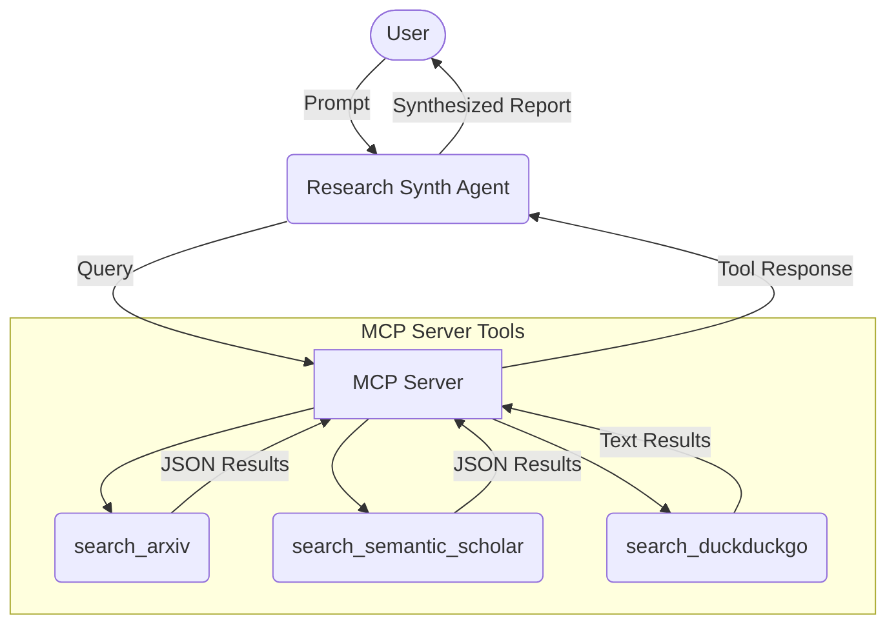
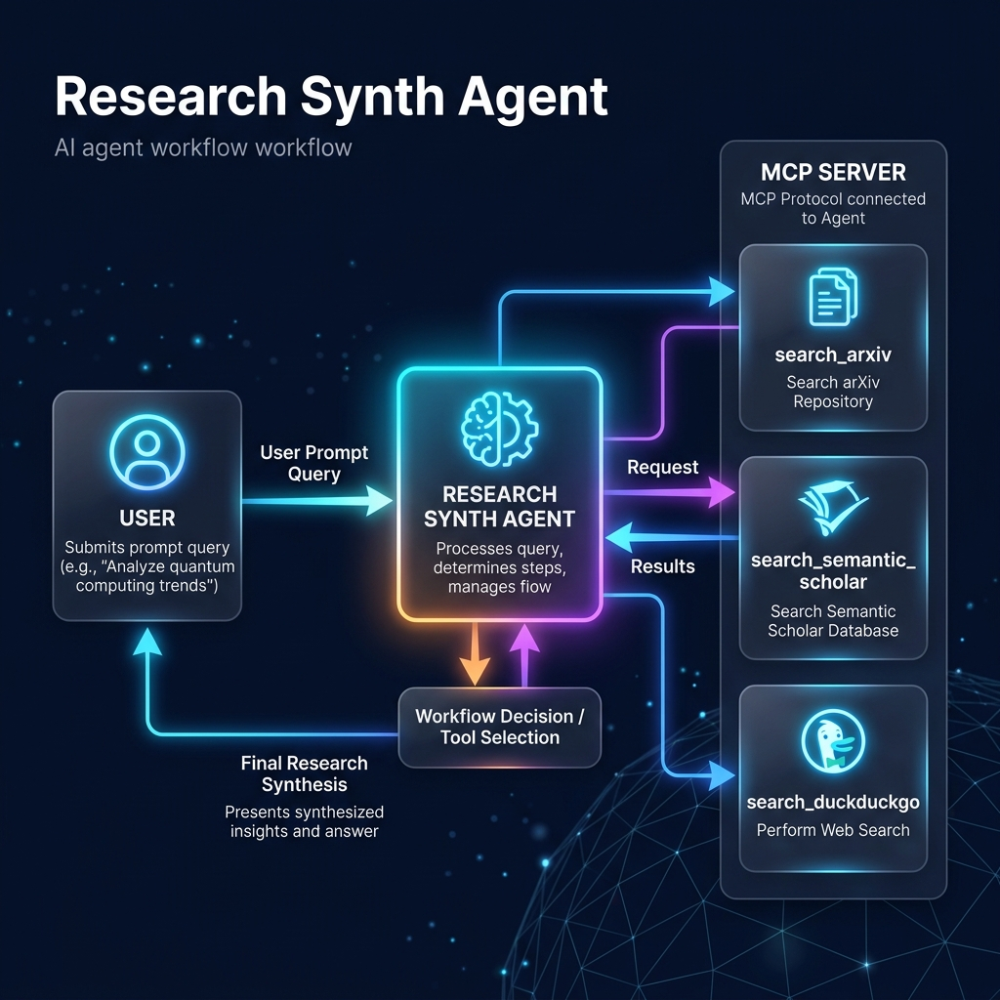

# Research Synth Agent

**An automated academic research assistant that queries databases, extracts key findings, and synthesizes reports.**

## Prerequisites
- Python 3.11+
- [uv](https://github.com/astral-sh/uv) (for dependency management)
- A Gemini API key from [Google AI Studio](https://aistudio.google.com/apikey)

## Quick Start
```bash
git clone <repo-url>
cd research-synth-agent
cp .env.example .env   # add your GOOGLE_API_KEY
make install
make playground        # opens UI at http://localhost:18081
```

## Architecture Diagram


## How to Run
- **`make playground`** → Opens the interactive ADK Web UI test environment.
- **`make run`** → Runs the local web server mode.

## Sample Test Cases

### Case 1: Standard Academic Search
**Input:** "Find recent papers on transformer models in healthcare."
**Expected:** The agent calls `search_arxiv` or `search_semantic_scholar`, retrieves 5 papers, and outputs a bulleted list with titles, abstracts, and URLs.
**Check:** In the playground UI, you should see the agent making tool calls to the MCP server, followed by a markdown-formatted response.

### Case 2: Broad/News Search (Fallback)
**Input:** "What is the latest news regarding Google AI announcements this week?"
**Expected:** The agent attempts academic searches, but finding nothing relevant, falls back to `search_duckduckgo`.
**Check:** The output contains web snippets and links pulled via DuckDuckGo.

### Case 3: Specific Paper Lookup
**Input:** "Find the paper 'Attention is all you need' and summarize its key findings."
**Expected:** The agent queries Semantic Scholar with the exact title, retrieves the abstract, and outputs a summary.
**Check:** The output correctly links to the original 2017 paper.

## Troubleshooting

1. **`429 RESOURCE_EXHAUSTED` Error**
   - **Cause:** You hit the Gemini free-tier burst limit due to rapid multi-turn tool calls.
   - **Fix:** Wait 30 seconds and try again, or switch `GEMINI_MODEL` to a newer model like `gemini-3.5-flash` in your `.env` file. We have added a 25-second delay to MCP tools to prevent this from happening automatically.

2. **Playground Connection Errors (Port 18081 or 8090 in use)**
   - **Cause:** A previous instance of the ADK playground or MCP server was not shut down cleanly.
   - **Fix:** In PowerShell, run: `Get-Process -Id (Get-NetTCPConnection -LocalPort 18081, 8090 -ErrorAction SilentlyContinue).OwningProcess | Stop-Process -Force`

3. **`AttributeError: 'str' object has no attribute 'model_copy'`**
   - **Cause:** Attempting to run `agent.run_async("prompt")` directly with a string instead of an ADK `InvocationContext`.
   - **Fix:** Always use the ADK `Runner` or the Web UI to execute the agent.

## Push to GitHub

1. Create a new repo at https://github.com/new
   - Name: research-synth-agent
   - Visibility: Public or Private
   - Do NOT initialize with README (you already have one)

2. In your terminal, navigate into your project folder:
```bash
cd research-synth-agent
git init
git add .
git commit -m "Initial commit: research-synth-agent ADK agent"
git branch -M main
git remote add origin https://github.com/<your-username>/research-synth-agent.git
git push -u origin main
```

3. Verify `.gitignore` includes:
```text
.env          # ← your API key — must NEVER be pushed
.venv/
__pycache__/
*.pyc
.adk/
```
⚠ NEVER push `.env` to GitHub. Your API key will be exposed publicly.

## Assets




## Demo Script
A presentation and demo script for this project is available in [DEMO_SCRIPT.txt](DEMO_SCRIPT.txt).
