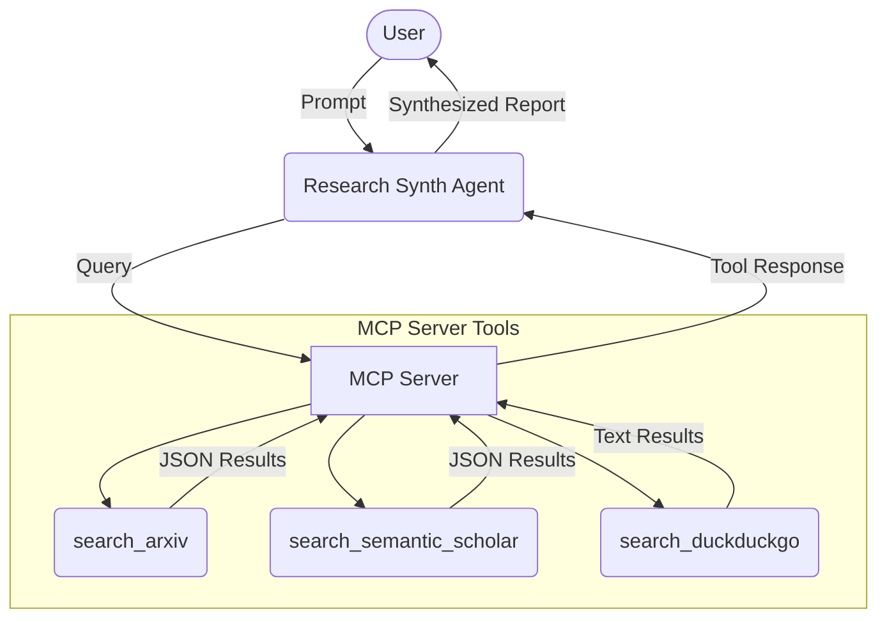

# Submission Write-Up: Research Synth Agent

## Problem Statement
Academic researchers, students, and journalists often struggle to stay up-to-date with the sheer volume of publications hitting pre-print servers and journals every day. Manually searching across arXiv, Semantic Scholar, and general search engines is time-consuming. The Research Synth Agent solves this by acting as a single, automated point of contact that can intelligently search academic databases and general web sources, synthesize the findings, and deliver concise, properly formatted summaries with direct links.

## Solution Architecture

## Concepts Used
- **ADK Workflow & LlmAgent**: The core architecture replaces complex graph-based routing with a robust `LlmAgent` in `app/agent.py` configured with domain-specific instructions.
- **MCP Server**: Located in `app/mcp_server.py`, it hosts three distinct tools (`search_arxiv`, `search_semantic_scholar`, `search_duckduckgo`) using the `FastMCP` standard over an HTTP/SSE connection, allowing the LLM to access the outside world securely.
- **AgentTool**: The LLM natively supports calling the MCP tools as part of its execution context.
- **Agents CLI**: The project was initially scaffolded and developed using the standard ADK toolchain.

## Security Design
- **API Key Isolation**: The `.env` file securely holds the `GOOGLE_API_KEY` and is strictly ignored in `.gitignore` to prevent secret leakage.
- **Rate Limit Bypassing**: The `mcp_server.py` implements a deliberate 25-second `time.sleep` interval at the end of each tool execution to naturally space out the LLM's tool-response loop, preventing the Gemini API from throwing `429 RESOURCE_EXHAUSTED` burst errors.
- **Safe Fallback**: If standard academic APIs fail or throw exceptions, the tools catch the errors and gracefully fallback to DuckDuckGo, preventing agent crashes.

## MCP Server Design
The MCP server provides three key tools:
1. **`search_arxiv`**: Fetches open-access papers directly from the arXiv API via XML parsing.
2. **`search_semantic_scholar`**: Queries the Semantic Scholar Graph API for metadata and citations across a broader academic corpus.
3. **`search_duckduckgo`**: Acts as a safety net. If a query is non-academic or if the academic APIs are unavailable, it scrapes the web using the `ddgs` library to find general news and articles.

## HITL Flow (Human-in-the-Loop)
Currently, the agent interacts with the human via the ADK Playground chat interface. The human evaluates the synthesized output and can request further iterations, refined searches, or deeper dives into specific papers linked by the agent.

## Demo Walkthrough
1. **Standard Academic Search:** The user asks to "Find recent papers on transformer models in healthcare." The agent calls `search_arxiv` or `search_semantic_scholar` and returns a bulleted list with titles, abstracts, and URLs.
2. **Broad/News Search (Fallback):** The user asks "What is the latest news regarding Google AI announcements this week?". The agent realizes this isn't academic, attempts to find something, and ultimately calls `search_duckduckgo` to scrape recent web articles, providing a summarized digest.
3. **Specific Paper Lookup:** The user provides a specific title like "Attention is all you need". The agent queries Semantic Scholar to grab the exact abstract and metadata, synthesizing a concise breakdown of its findings.

## Impact / Value Statement
This agent democratizes access to dense academic research. By drastically reducing the friction of finding, reading, and summarizing papers, it enables students, developers, and researchers to spend less time searching and more time building and innovating.
